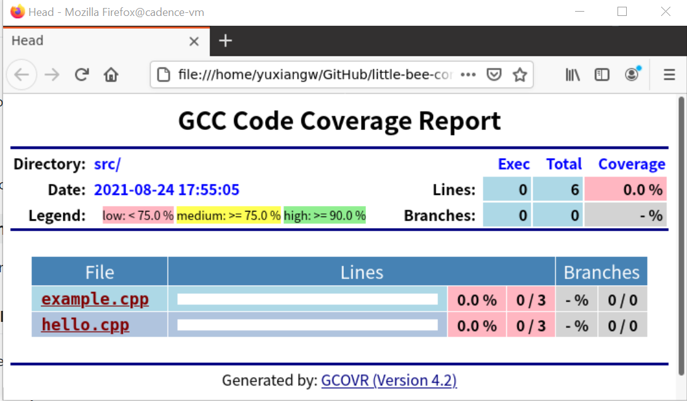
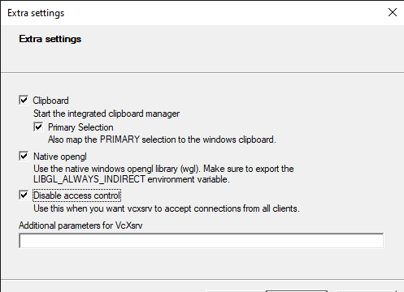

## How to Build
### `make`
* build release version project

### `make debug`
* build debug version project
* If you want to debug with gdb, please build debug version
* To debug with VS Code, using the [launch.json](.vscode/launch.json)

### `make run`
* run the google tests in './test'

### `make cov`
* create test coverage html using "gcovr", then run firefox to open "./build/cov/coverage.html"



### `make clean`
* clean the project

## CMake Intro
* CMake Reference - https://cliutils.gitlab.io/modern-cmake/chapters/basics.html

### Setting a project
* [Wiki](https://cmake.org/cmake/help/latest/command/project.html?highlight=project)
```
project(<PROJECT-NAME> [<language-name>...])
project(<PROJECT-NAME>
        [VERSION <major>[.<minor>[.<patch>[.<tweak>]]]]
        [DESCRIPTION <project-description-string>]
        [HOMEPAGE_URL <url-string>]
        [LANGUAGES <language-name>...])
```
* Example: [CMakeLists.txt](./CMakeLists.txt)
```
project(cpp_startup_project VERSION 1.0
                DESCRIPTION "C++ Start Up Project"
                LANGUAGES CXX)
```

### Making an executable
* [Wiki](https://cmake.org/cmake/help/latest/command/add_executable.html)
```
add_executable(<name> [WIN32] [MACOSX_BUNDLE]
               [EXCLUDE_FROM_ALL]
               [source1] [source2 ...])
```
* Example: [CMakeLists.txt](./test/CMakeLists.txt)
```
add_executable(
    unit_tests
    test_example.cpp
    test_hello.cpp
  )
```

### Making a library
* [Wiki](https://cmake.org/cmake/help/latest/command/add_library.html)
```
add_library(<name> [STATIC | SHARED | MODULE]
            [EXCLUDE_FROM_ALL]
            [<source>...])
```
* Example: [CMakeLists.txt](./src/CMakeLists.txt)
```
add_library(example)
```

### Targets Commands
* [target_include_directories](https://cmake.org/cmake/help/latest/command/target_include_directories.html)
```
target_include_directories(<target> [SYSTEM] [AFTER|BEFORE]
  <INTERFACE|PUBLIC|PRIVATE> [items1...]
  [<INTERFACE|PUBLIC|PRIVATE> [items2...] ...])
```
* [target_link_libraries](https://cmake.org/cmake/help/latest/command/target_link_libraries.html)
```
target_link_libraries(<target> ... <item>... ...)
```

## How to set up VcXsrv
* Purpose
  * run firefox in remote VS Code terminal
* Steps
  * Install VcXsrv at windows
  * Open VcXsrv with "Disable access control"<br>
    
  * Get VcXsrv DISPLAY value from the icon, such as: `PC-YUXIANGW:0.0`
  * Set DISPLAY env in VS Code terminal: such as: `export DISPLAY=PC-YUXIANGW:0.0`
  * Run `firefox` command in VS Code terminal, the browser will show in windows locally